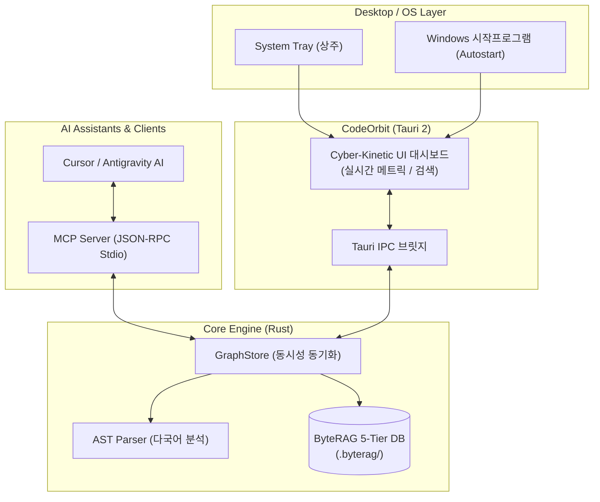

# 🛰️ CodeOrbit 시스템 개요 (System Overview)

## 1. CodeOrbit이란 무엇인가요?

**CodeOrbit**은 거대 코드베이스(Rust, C++, C#, TypeScript, Python 등)의 구조를 AST(추상 구문 트리) 기반으로 실시간 분석하고, 심볼(클래스, 구조체, 함수, 인터페이스) 간의 **의존성 지식 그래프(Knowledge Graph)**를 구축하여 AI 어시스턴트(Antigravity, Cursor 등)에게 **고속 MCP(Model Context Protocol)** 도구로 제공하는 **백그라운드 데스크톱 지식 엔진**입니다.

---

## 2. 왜 필요한가요? (기존 방식과의 차이점)

| 비교 항목 | 기존 단순 텍스트 검색 / RAG | CodeOrbit (AST Graph Engine) |
| :--- | :--- | :--- |
| **코드 이해 방식** | 단순 파일명 매칭 또는 텍스트 청크 단위 검색 | 코드 구문(AST)을 분석하여 함수-클래스-호출 관계 구조화 |
| **의존성 파악** | 함수 수정 시 영향받는 코드를 사람이 직접 찾아야 함 | `byterag_blast_radius`로 수정 시 영향받는 상위 모듈 자동 탐지 |
| **최단 호출 경로** | 모듈 간 호출 관계 추적 불가 | `byterag_find_path`로 A와 B 사이의 함수 호출 체인 계산 |
| **순환 참조 감지** | 빌드 에러가 나기 전까지 발견 어려움 | `byterag_detect_cycles`로 순환 의존 모듈 즉시 발견 |
| **속도 및 저장** | LLM 토큰 낭비 심함, 느림 | **ByteRAG Pure Rust 5-Tier 엔진**으로 밀리초 단위 초고속 응답 |

---

## 3. 핵심 아키텍처 구성 요소

1. **`crates/byterag-codegraph`**:
   - **AST 파서 (`parser.rs`)**: 다국어 소스코드에서 선언, 정의, 호출, 임포트, 상속 관계 추출.
   - **지식 그래프 엔진 (`store.rs`)**: 인메모리 `CsrGraph` BFS 순회 + `ByteRAG` 영속 KV/Graph DB 연동.
   - **MCP 서버 (`main.rs`)**: AI IDE와 통신하는 13종 JSON-RPC Stdio 인터페이스.
2. **`crates/codeorbit`**:
   - **Tauri 2 데스크톱 앱**: 시스템 트레이 상주, 부팅 시 자동 시작, 단일 인스턴스 락, 모던 다크 UI 제공.
   - **웹 대시보드 (`ui/index.html`)**: Stitch AI 기반 Cyber-Kinetic 디자인 시스템.
