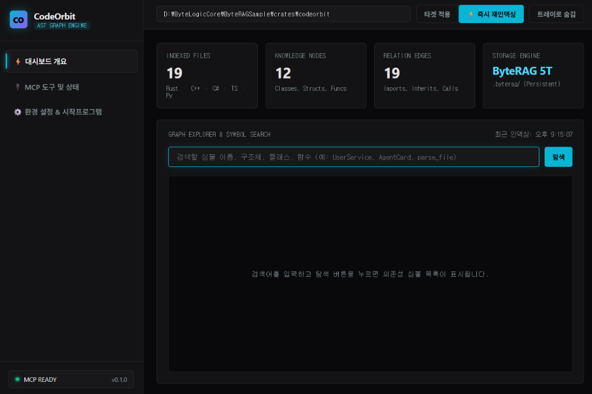

# 🖥️ CodeOrbit 실제 화면 기반 완벽 UI 매뉴얼

올려주신 **실제 구동 화면**을 기준으로 화면의 모든 구역과 버튼, 텍스트, 카드 컴포넌트가 **어떤 목적이고 어떻게 동작하는지** 1부터 10까지 상세히 설명해 드립니다.

---

## 📸 실제 구동 화면 구조도



위 화면은 크게 **① 좌측 네비게이션 & 상태 바**, **② 상단 타겟 제어 바**, **③ 중앙 실시간 4대 지표 카드**, **④ 하단 그래프 심볼 탐색기** 총 4개의 핵심 영역으로 구성되어 있습니다.

---

## 1. 상단 타겟 제어 바 (Top Control Bar)

```
[ D:\ByteLogicCore\ByteRAGSample\crates\codeorbit ]  [ 타겟 적용 ]  [ ⚡ 즉시 재인덱싱 ]  [ 트레이로 숨김 ]
```

| 컴포넌트명 | 기능 및 사용 목적 | 상세 동작 원리 |
| :--- | :--- | :--- |
| **경로 입력창**<br>`(Target Directory)` | **분석할 소스코드 폴더 경로 지정** | 현재 그래프 엔진이 스캔하고 있는 프로젝트 루트 폴더입니다. (예: `D:\ByteLogicCore\ByteRAGSample`) |
| **[타겟 적용] 버튼** | **대상 프로젝트 즉시 변경** | 입력창에 다른 프로젝트 경로를 적고 이 버튼을 누르면, 엔진이 해당 폴더로 이동하여 AST 파싱을 새로 시작합니다. |
| **[⚡ 즉시 재인덱싱] 버튼** | **수정된 코드 즉시 재스캔** | 코드를 새로 작성하거나 파일이 변경되었을 때 클릭하면 백그라운드 워커가 변경된 파일(mtime 기준)을 즉시 다시 분석해 그래프를 갱신합니다. |
| **[트레이로 숨김] 버튼** | **백그라운드 트레이로 내리기** | 대시보드 창을 닫지 않고 윈도우 우측 하단 작업표시줄(System Tray)로 숨깁니다. MCP 서버는 백그라운드에서 계속 상주합니다. |

---

## 2. 중앙 실시간 4대 지표 카드 (Metrics Cards)

프로젝트 코드베이스의 **규모와 지식 그래프 구축 상태**를 한눈에 보여주는 카드입니다.

```
┌─────────────────┐ ┌─────────────────┐ ┌─────────────────┐ ┌─────────────────┐
│  INDEXED FILES  │ │ KNOWLEDGE NODES │ │ RELATION EDGES  │ │ STORAGE ENGINE  │
│  19             │ │ 12              │ │ 19              │ │ ByteRAG 5T      │
│  Rust·C++·C#·TS │ │ Classes, Structs│ │ Imports, Calls  │ │ .byterag/       │
└─────────────────┘ └─────────────────┘ └─────────────────┘ └─────────────────┘
```

| 카드명 | 표시되는 숫자 / 의미 | 왜 알아야 하나요? |
| :--- | :--- | :--- |
| **INDEXED FILES**<br>`19` | 분석 대상 폴더에서 스캔 완료한 **소스코드 파일 수** | Rust, C++, C#, TS, Py 파일 중 파싱 대상이 된 전체 파일 개수입니다. |
| **KNOWLEDGE NODES**<br>`12` | 추출된 **핵심 심볼 노드 개수** | 코드에서 발견된 클래스(Class), 구조체(Struct), 함수(Function), 트레이트(Trait) 등 개별 코드 단위의 총합입니다. |
| **RELATION EDGES**<br>`19` | 심볼 간의 **연결 관계(간선) 개수** | 어떤 함수가 다른 함수를 호출하는지(`calls`), 모듈을 임포트하는지(`imports`), 상속/구현하는지(`implements`)의 관계 총수입니다. |
| **STORAGE ENGINE**<br>`ByteRAG 5T` | 그래프가 저장되는 **저장소 엔진 상태** | 프로젝트 루트의 `.byterag/` 폴더 내에 순수 Rust 초고속 영속 DB(5-Tier KV & Graph)로 안전하게 저장되어 있음을 나타냅니다. |

---

## 3. 하단 심볼 탐색기 (Graph Explorer & Search)

AI나 개발자가 **특정 함수나 구조체가 코드 어디에 정의되어 있는지** 대시보드에서 직접 찾아볼 수 있는 도구입니다.

```
[ 검색할 심볼 이름, 구조체, 클래스, 함수 (예: UserService, AgentCard, parse_file) ]  [ 탐색 ]
─────────────────────────────────────────────────────────────────────────────
(검색 결과 목록이 여기에 카드 형태로 렌더링됩니다)
```

1. **검색창**: 궁금한 심볼(예: `AppState`, `GraphStore`, `get_index_status`, `main`)을 입력합니다.
2. **[탐색] 버튼 (또는 Enter)**: 누르면 `ByteRAG` 지식 그래프를 초고속 조회하여 일치하는 심볼을 즉시 찾아옵니다.
3. **결과 카드 항목**:
   - 심볼 이름 (예: `struct AppState`)
   - 정의된 파일 위치 및 라인 번호 (예: `crates/codeorbit/src/main.rs (L15)`)
   - 언어 및 타입 배지 (예: `[STRUCT]`, `[FUNCTION]`)

---

## 4. 좌측 네비게이션 & 상태 바 (Sidebar & Status)

```
[ CO ] CodeOrbit
AST GRAPH ENGINE
────────────────────
⚡ 대시보드 개요  (현재 화면)
🔌 MCP 도구 및 상태
⚙️ 환경 설정 & 시작프로그램
────────────────────
● MCP READY   v0.1.0
```

| 메뉴 / 상태 | 기능 및 역할 |
| :--- | :--- |
| **⚡ 대시보드 개요** | 위에서 설명한 실시간 지표 및 심볼 탐색기가 있는 메인 홈 화면입니다. |
| **🔌 MCP 도구 및 상태** | AI(Cursor, Antigravity)가 원격으로 호출할 수 있는 13가지 MCP 기능 리스트를 확인하는 화면입니다. |
| **⚙️ 환경 설정** | **"윈도우 부팅 시 자동 시작 (Autostart)"** 토글 스위치가 있는 설정 화면입니다. 켜두면 컴퓨터를 켤 때 백그라운드 트레이로 자동 실행됩니다. |
| **● MCP READY** | 초록색 불: AI 요청을 처리할 준비가 된 정상 상태.<br>주황색 불(`INDEXING...`): 코드를 분석 중인 상태. |

---

## 💡 한 줄 요약: 이 프로그램을 켜두면 뭐가 좋은가요?

> **"CodeOrbit을 백그라운드에 켜두면, 내가 코드를 수정할 때마다 자동으로 AST 관계망을 파악하여 Antigravity/Cursor AI가 내 프로젝트의 함수 호출 관계와 영향 범위를 틀리지 않고 완벽하게 이해하도록 돕습니다."**
